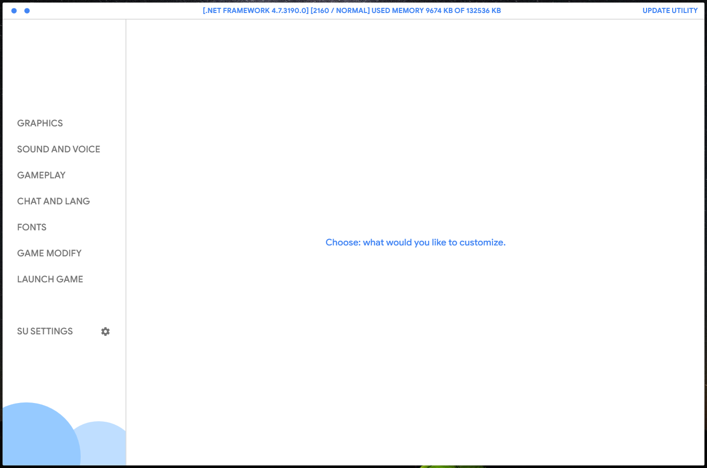
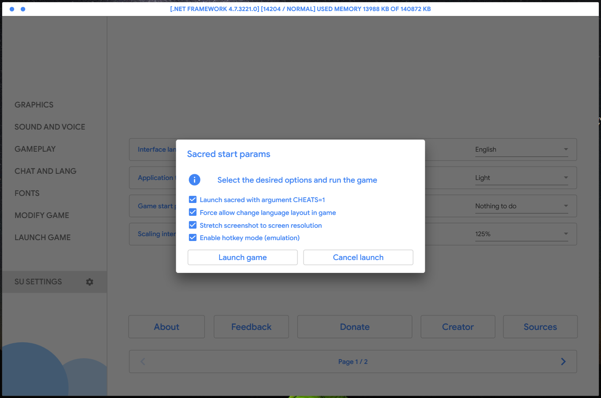
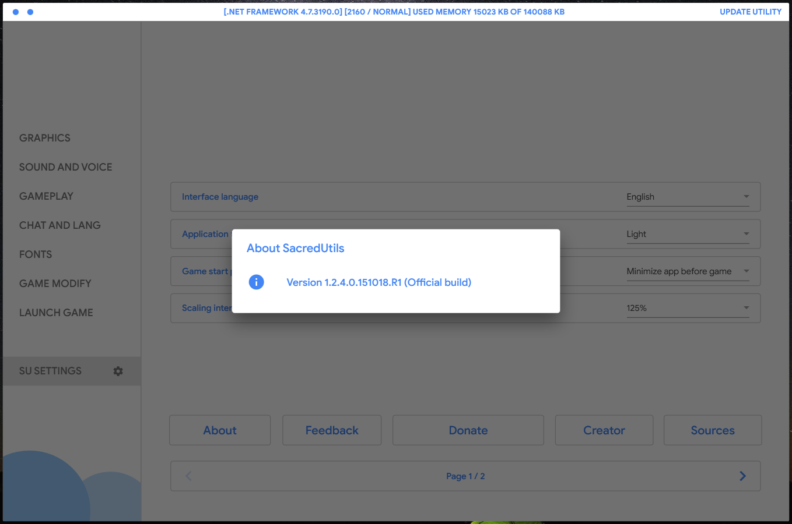
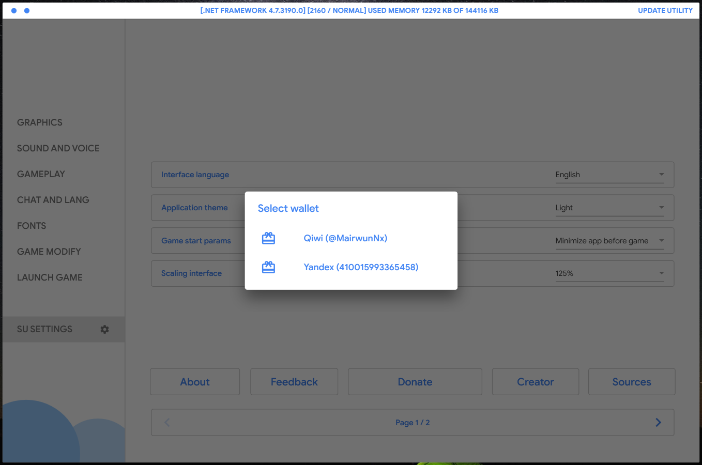
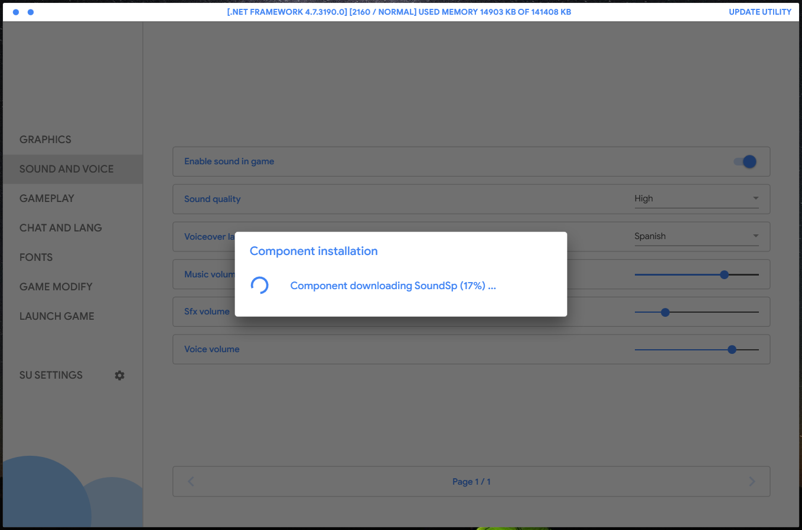
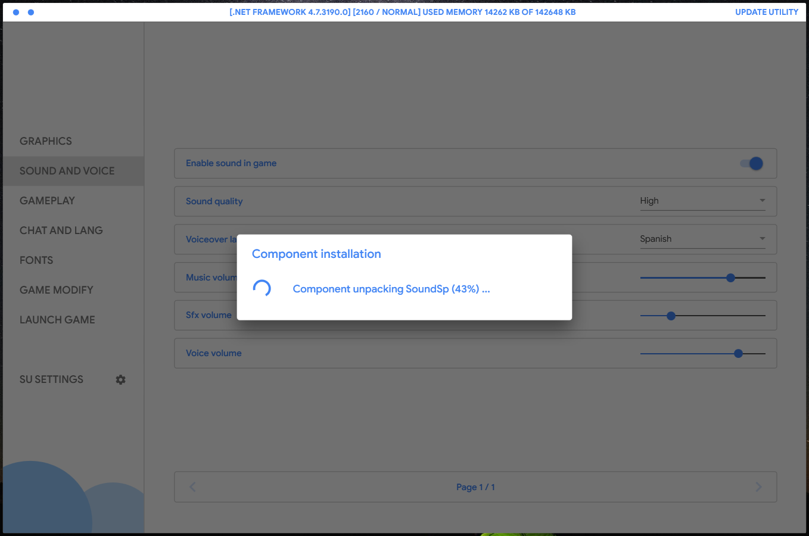
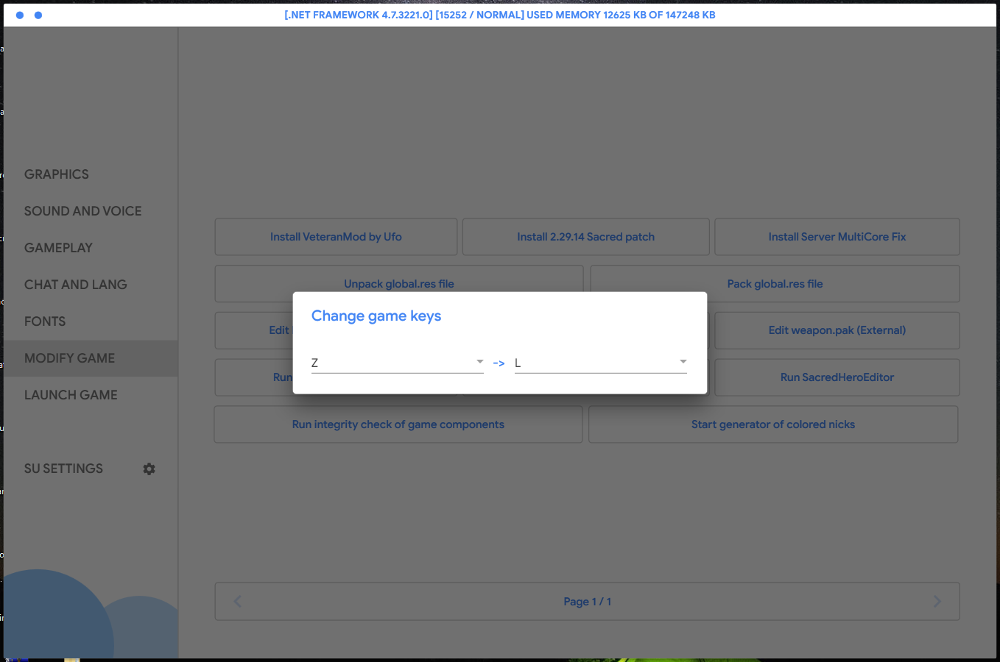

# SacredUtils
A powerful and beautiful configurator for Sacred and Sacred Underworld, with using the Material Design.

# Features

 * Material Design style application. Thanks [Material Design In Xaml](https://github.com/MaterialDesignInXAML/MaterialDesignInXamlToolkit).
 * Many useful and very useful settings for the game Sacred and Sacred Underworld.
 * Flexibility in customization, you can change a lot in SacredUtils!
 * Constant support and updates, bug fixes, help with the game.
 * Convenient management of settings and quick work.
 * Compatible from Sacred 1.0 to Sacred 2.29.14. (Modifications not supported (e.g FaithfulMod, RavenRock)).
 * Run the game with optimized parameters right from the SacredUtils!
 * Installing voiceovers (ru, en, de, sp) and gui languages (ru, en, de, sp, fr), and gameserver multicore fix!
 * Installing veteran mod and veteran mod dragon fix (by UFO or thourium).
 * Installing 2.29.14 and 2.28.01 patches on Sacred Underworld!
 * Running balance.bin and creature.pak and weapon.pak editors!
 * Running Sacred Hero editor, Sacred Hotkey Tweaker, Sacred Hero Resetter!
 * Possibility automatic creating colored nicknames! For one second!
 * Working with global.res files (e.g decompiling and compiling global.res).
 * Settings generation, auto generate settings.cfg if there is no file.
 * Is multilanguage! SacredUtils support: ru, en languages. (en semi-machine translation).
 * Check the components of the Sacred Underworld (only 2.28 - 2.29.14) for integrity!
 * Enabling or disabling func "Water animation" without set low graphics!
 * Enabling or disabling func "bog animation", "lava animation", "player footprints".
 * Restoring old Sacred interface, all likes a lot, I think so.
 * Ability changing keyboard language layout simple in game! (Shift + Alt)
 * Ability running Sacred with CHEATS=1 argument, easy, lol, with fun cheaters.
 * Ability create screenshots in FullHD resolution and high (over 4k) :D
 * Cool, very fast and cool x2 change hotkey function, use our hotkeys :DD

# Downloads

 * Download the source and run the SacredUtils (compiling source requires VS2017+ and .NET 4.7.2+ and C# 7.3).
 * Download a pre-compiled SacredUtils from the [releases](https://github.com/MairwunNx/SacredUtils/releases) page.
 * Download latest version from google drive [Release](https://drive.google.com/file/d/1sDiiIYW0_JXMqh6IAHMOyf3IKPySCr4Q/view) type or [Alpha](https://drive.google.com/file/d/1xZzaj0v41S7nkSXkn4GWoDTkBtzeRc2Y/view) type.
 
# Change Log

 * See SacredUtils change log [here](https://github.com/MairwunNx/SacredUtils/blob/master/CHANGELOG.md) (latest version above change log page).

# Want to say thanks?

 * Hit the star button or say thanks message to MairwunNx@gmail.com .
 * May be... Donate please :) [QIWI](https://qiwi.me/mairwunnx) or [Yandex.Money](https://money.yandex.ru/to/410015993365458).
 * Well, or the easiest way to leave feedback [here](https://docs.google.com/forms/d/e/1FAIpQLSfkNwFlN2VV_gju2jo9iTxb5FRfmuUZC6FM-vd2ZErQBA1gwQ/viewform).

# Special thanks

 * Special thanks to Sha**no*us for testing for errors and bugs and design work test!
 * Special thanks to Keboo for beautiful Material Design library and for help with code!
 * Special thanks to Resharper for the free student license! Use this wonderful product!

# In future

 * All tasks for the future are made! If you have idea, open Issue or send it on email me.

# Screenshots

