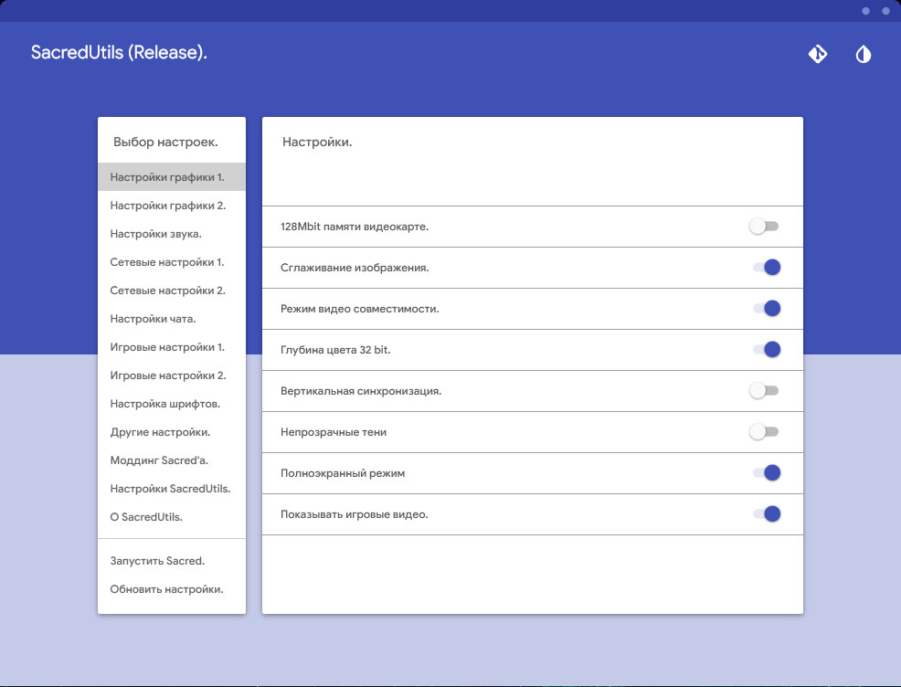
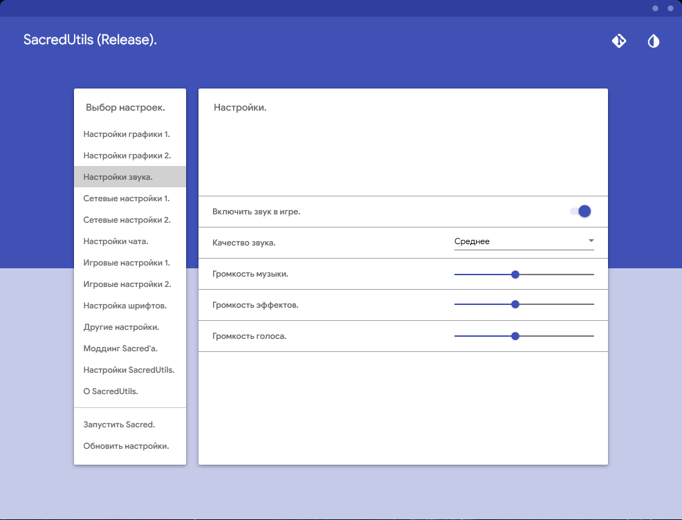
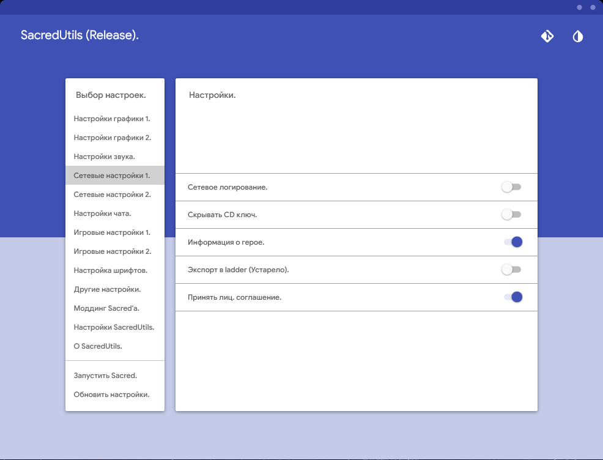
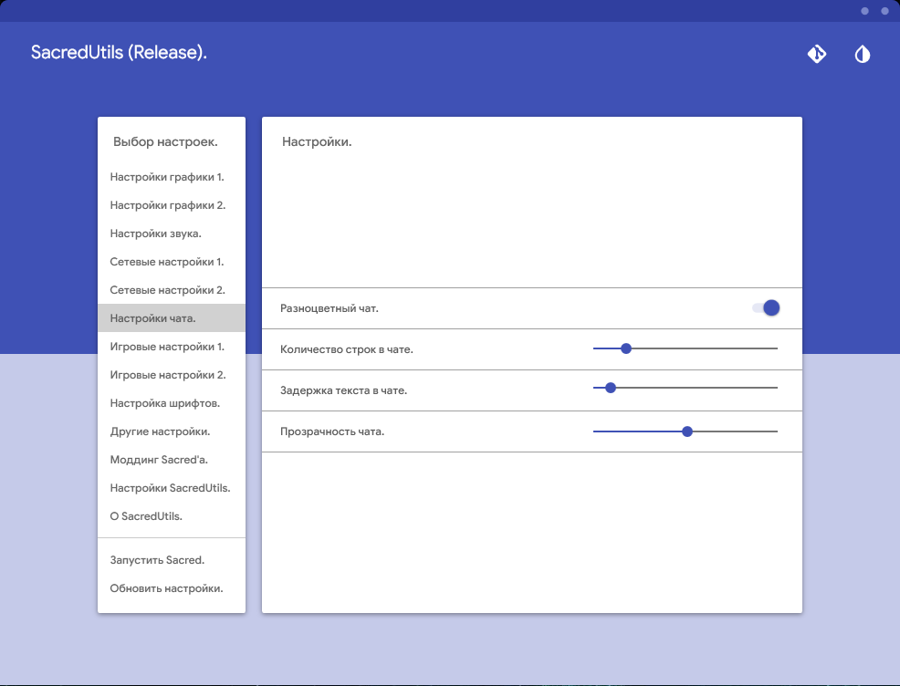
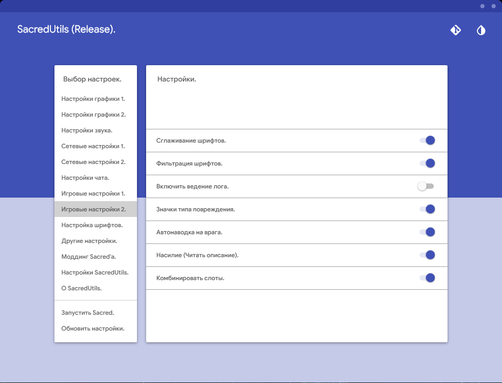
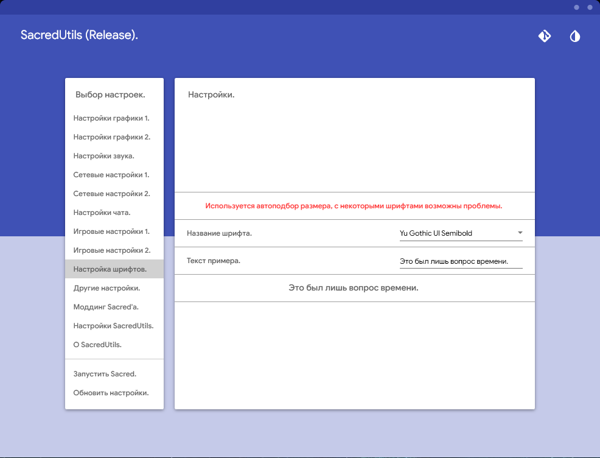
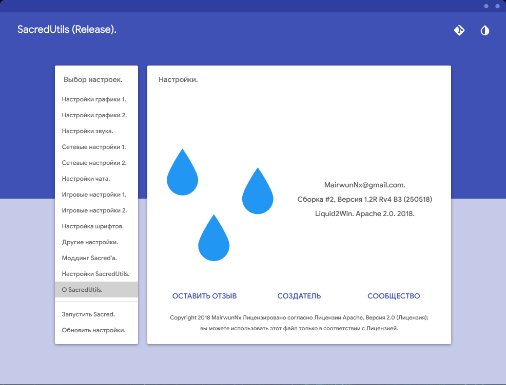

# SacredUtils
A simple and beautiful configurator for Sacred Underworld, with using the MaterialDesign.

# Summary

 * Material Design style application. Thanks [Material Design In Xaml](http://materialdesigninxaml.net/).
 * Many useful and very useful settings for the game Sacred.
 * Flexibility in customization, you can change a lot in SacredUtils!
 * Constant support and updates, bug fixes, help with the game.
 * Convenient management of settings and quick work.
 * Compatible from Sacred 1.0 to Sacred 2.29.14. (Modifications not supported).
 * Run the game with optimized parameters right from the SacredUtils!
 
# See It Action
 
 * Download the source and run the SacredUtils (compiling source requires VS2017+).
 * Download a pre-compiled SacredUtils from the [releases](https://github.com/MairwunNx/SacredUtils/releases) page.
 
# Screenshots
 

